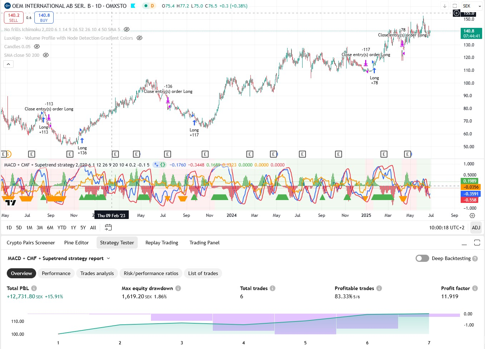

# MACD, CMF + Supertrend strategy for Trading View
A TradingView long strategy made with PineScript

## Overview

* Buy when CMF and both MACD lines are above 0 + configurable threshold.
* Sell when CMF and MACD-line is below 0 + configurable threshold - but don't sell if SuperTrend is bullish.
* Configurable stop loss, default 5%
* Configurable start for strategy

## Updates

- 2025-06-27: Created project. Vibe coded with Claude Sonnet 4.
